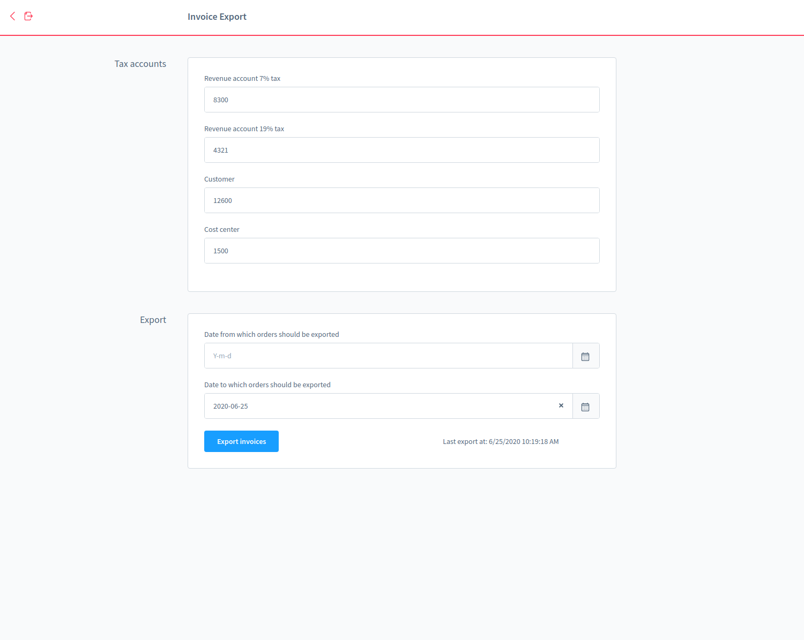

# Invoice Export Shopware Plugin

This plugin provides a menu entry that allows invoices to be exported and then automatically downloaded in a .csv-File from the Shopware 6 Administration.

The plugin collects orders from a definable period and exports them in a specified format as a CSV file. The following settings can be saved:

- Revenue account at 7%
- Revenue account at 19%
- Customer
- Cost centre

The default format is not customizable for now. The exported CSV file contains the following columns:

- Date
- Revenue account
- Customer
- Cost centre
- EUR
- Invoice amount
- Customers' Name
- bill number

